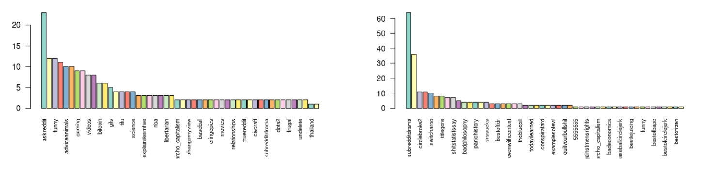
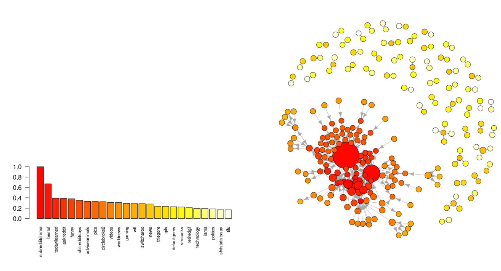

# Subreddit Hyperlink analysis Using R
* This repository analyze the ’Social Network: Reddit Hyperlink Network' dataset using R.
* The hyperlink network represents the directed connections between two subreddits. This network dataset is extracted from publicly available Reddit
data of 2.5 years from Jan 2014 to April 2017.

## Overview
 The subreddit-to-subreddit hyperlink network is extracted from
the posts that create hyperlinks from one subreddit to another. A hyperlink originates from a post in the source community and links to a post in the target community. Each hyperlink is annotated with three properties:
the timestamp, the sentiment of the source community post towards the target community post, and the text property vector of the source post. The network is directed, signed, temporal, and attributed. The hyperlink
can be present in either the title of the post or in the body. So in this dataset, they provided two different network files, one network created from the hyperlinks in the title and the other one from the post. They have
also provided embedding vectors (a distributed representation for text) representing each subreddit.

The dataset contains a total 55,863 number of subreddits/nodes and 858,490 hyperlinks between subreddits/number of edges. Every edge is also labeled with positive or negative emotions by -1 or +1. There is also a Text Property Vector or Embedding Vector associated with every source subreddit.

## Run
Open the project in RStudio. Alternatively to run the script in bash run the following command.
```
Rscript subreddit.R 
```
## Sample Outputs
Bar plot of subreddits on degree in (left) and degree out (right)



Eigen Centralities of the Network between subreddits



More can be found in `network-analysis-with-r.pdf` file.

## Contact
Rajesh Baidya ([rajeshbaidya.006@gmail.com](mailto:rajeshbaidya.006@gmail.com?subject=[GitHub]%20Source%20Han%20Sans))
